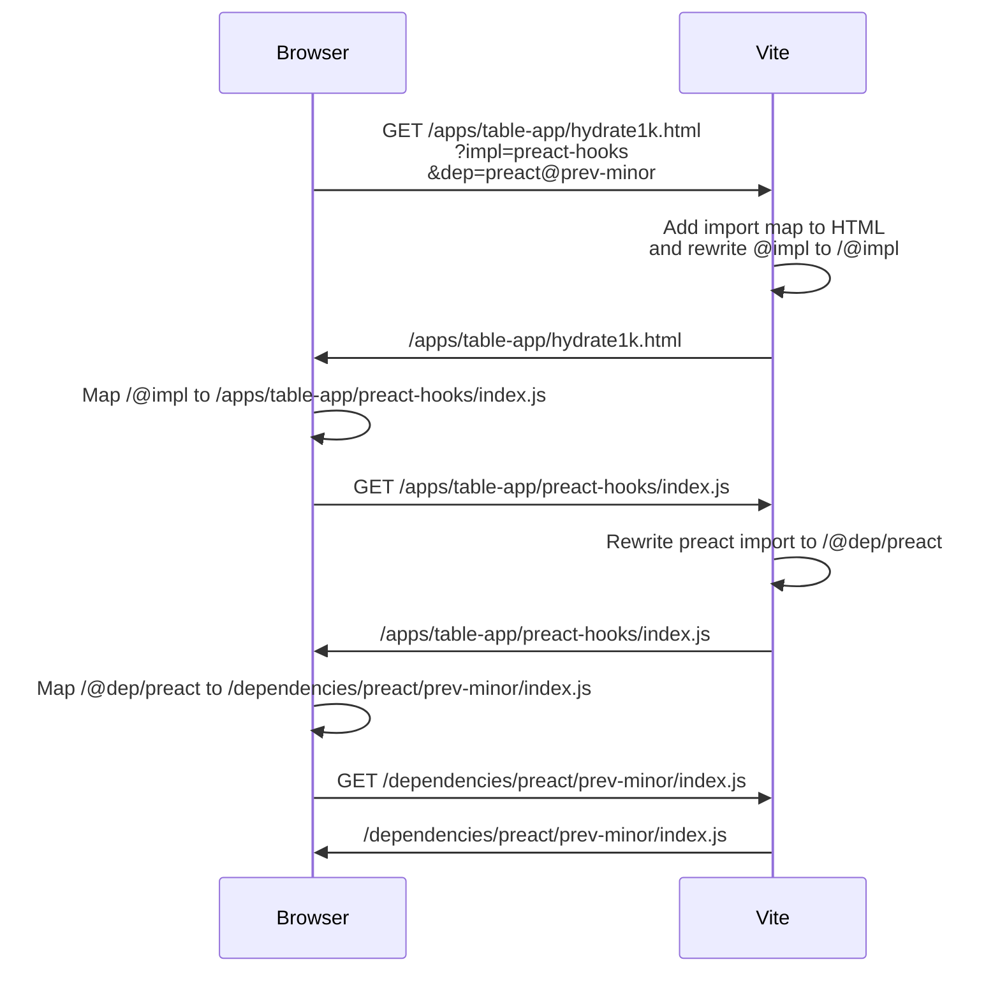

# Architecture

> For an early discussion of goals and outcomes we wanted from this repo, see
> <https://github.com/preactjs/benchmarks/discussions/1>

## Concepts

There are 4 main organizational concepts used in this repo:

| Concept        | Description                                                                                                                                       |
| -------------- | ------------------------------------------------------------------------------------------------------------------------------------------------- |
| App            | A single page app that supports operations to be benchmarked (e.g. a TODO app, `/apps/todo` folder)                                               |
| Benchmark      | An HTML file that renders an app and measures various aspects a specific operation of that app (e.g. adding a new todo in `/apps/todo/todo.html`) |
| Implementation | An implementation of an app (e.g. Preact with class components or Preact using hooks, `/apps/todo/preact-class`)                                  |
| Dependency     | A dependency of an implementation (e.g. latest Preact version, `/dependencies/preact/latest`)                                                     |

We define these using a folder convention described below:

```text
- apps/
	- todo/ <-- An app
		- preact-class/  <-- An implementation of todo using Preact class components
		- preact-hooks/  <-- ... ... using Preact class components
		- preact-compat/ <-- ... ... using Preact compat
		- ...
		- todo.html <-- A specific benchmark using the todo app
		- ...
	- filter-list/
- dependencies/ <-- Collection of dependencies whose version can be overridden
	- preact/
		- local/  <-- A local version of Preact
		- latest/ <-- The latest version of Preact
		- v8/     <-- A specific version of Preact
	- @preact/signals/
		- local/
		- latest/
		- ...
	- ...
```

All implementations of an app expose the same API. This requirement allows us to compare the performance of different implementations of the same app. For example, we can compare the performance of a Preact class component implementation of a TODO app with a Preact hooks implementation of the same app.

All version of a dependency have the same API as best as possible. This constraint allows us to compare the performance of different versions of the same dependency. For example, we can compare the performance of Preact v8.0.0 with Preact v10.0.0. Obviously, some things aren't possible, such as implementing hooks in Preact v8.0.0, but we can still compare the performance of the features & behaviors that are shared between versions.

### Dependencies

Each app is implemented using a JS framework (namely Preact or one of our ecosystem libraries). It is useful to be able to measure and compare how different versions of a framework perform. For example, we might want to compare how Preact v10.5.0 performs compared to Preact v10.6.0. Or how a change in my local repository of Preact performs compared to the latest version of Preact.

All of the dependencies we support comparing are in the `<repo root>/dependencies` directory. Each dependency has a directory named after the dependency (and scoped dependencies are nested so `@preact/signals` will be in the `dependencies/@preact/signals` folder). Inside that directory are directories for each version of that dependency that we support. For example, the `preact` directory contains a `local` directory that will load code from a local clone of Preact repository. It also contains a `latest` directory that contains the latest version of Preact from NPM.

Inside these directories are the files that are needed to load that dependency. For example, the `local` directory contains scripts to setup loading from a local Preact repository. The `latest` directory contains a `package.json` file that points to the latest version of Preact on NPM. Inside these "proxy packages" you can implement code to normalize minor API differences that may exist between differences versions.

## Benchmark server

In order to actually run benchmarks, we need a server to serve the benchmark HTML files. We use Vite as this server, customized to support our needs. The primary objective is to:

1. Serve benchmark HTML files
2. Map the `impl` query parameter to the correct implementation directory
3. Map the `dep` query parameter to the correct dependency version directory

The URL to the HTML file specifies which implementation and versions of dependencies to use. For example, `http://localhost:5173/apps/table-app/hydrate1k.html?impl=preact-hooks&dep=preact@prev-minor` loads the `hydrate1k.html` benchmark of the `table-app` using the `preact-hooks` implementation and the `prev-minor` version of Preact.

The Vite server reads the query parameters, generates an import map to map the `impl` and `dep` query parameters to the correct directories, and inserts it into the benchmark HTML file. This import map maps certain key imports to implementations and versions of dependencies. The benchmark file imports from `@impl` to get the implementation of the app and implementations should directly import their dependencies (e.g. import Preact from `preact` and `@preact/signals` from `@preact/signals`). The Vite server will handle mapping these to special paths that will cause them to be loaded using the HTML import map and not Vite's default node_modules resolution.

Here is an example request flow:


